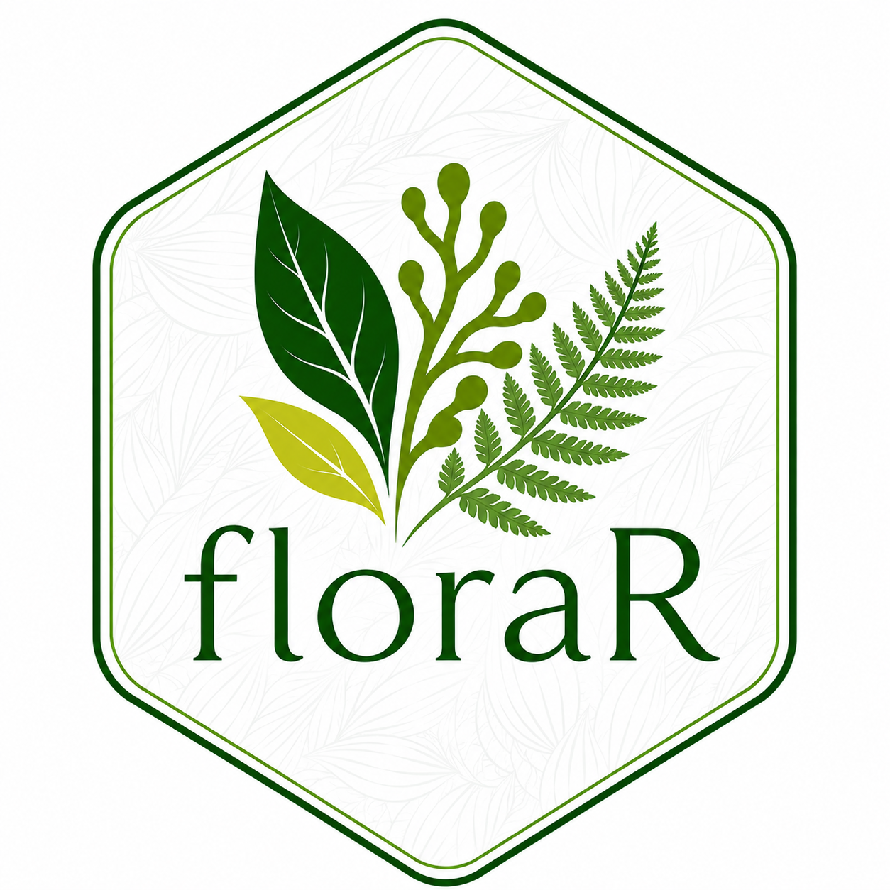

<!-- README.md is generated from README.Rmd. Please edit that file -->

```{r, include = FALSE}
knitr::opts_chunk$set(
  collapse = TRUE,
  comment = "#>",
  fig.path = "man/figures/README-",
  out.width = "100%"
)
```

# floraR 

<!-- badges: start -->
[](https://app.codecov.io/gh/DBOSlab/floraR)
[](https://github.com/DBOSlab/refloraR/actions/workflows/test-coverage.yaml)
[](https://cran.r-project.org/package=floraR)
[](https://github.com/DBOSlab/floraR/actions/workflows/R-CMD-check.yaml)
[](LICENSE)
<!-- badges: end -->

`floraR` is an R package for accessing, analyzing, and curating taxonomic and distributional data from the [Flora e Funga do Brasil (FFB)](https://floradobrasil.jbrj.gov.br/consulta/) platform, maintained by the Rio de Janeiro Botanical Garden. It provides a comprehensive interface to download, parse, and explore Darwin Core Archive (DwC-A) datasets from the [FFB IPT](https://ipt.jbrj.gov.br/jbrj/resource?r=lista_especies_flora_brasil) data portal.

The package is designed to streamline both data exploration for researchers and data curation workflows for taxonomic experts contributing to the Flora e Funga do Brasil.

## Installation

You can install the development version of `floraR` from [GitHub](https://github.com/DBOSlab/floraR) with:

``` r
# install.packages("devtools")
devtools::install_github("DBOSlab/floraR")
```

```r
library(floraR)
```
\
\

## Usage

`floraR` provides a three-step workflow for working with Flora e Funga do Brasil data:

- Check available versions with `flora_version()`
- Download datasets with `flora_download()`
- Parse and analyze with `flora_parse()` and `flora_records()`\
\

#### _1. `flora_version`: Check available dataset versions_

Get metadata about available Flora e Funga do Brasil dataset versions, including version numbers, release dates, and whether they are the latest version.\
```r
library(floraR)

# Get all available versions
versions_df <- flora_version()
head(versions_df)

# View specific version details
versions_df[versions_df$Latest == TRUE, ]
```
\
\

#### _2. `flora_download`: Download Flora e Funga do Brasil datasets_

Download taxonomic and distributional records in Darwin Core Archive (DwC-A) format. The function supports downloading the latest version, specific versions, or all available versions..\

```r
library(refloraR)

# Download the latest dataset version (default)
flora_download(dir = "flora_download")

# Download a specific version
flora_download(version = "393.418", dir = "flora_download")

# Download multiple versions
flora_download(version = c("393.418", "392.417"), dir = "flora_download")

# Download all available versions (large download!)
flora_download(version = "all", dir = "flora_download")
```
\
\

#### _3. `flora_parse`: Parse downloaded DwC-A datasets_

Parse and organize locally downloaded Flora e Funga do Brasil datasets for analysis. This function works offline once datasets are downloaded.\

```r
library(refloraR)

# Parse the latest downloaded version
dwca_data <- flora_parse(path = "flora_download", 
                         version = "latest")

# Parse all downloaded versions
dwca_all <- flora_parse(path = "flora_download", 
                        version = "all")

# Parse specific versions
dwca_specific <- flora_parse(path = "flora_download", 
                             version = c("393.418", "392.417"))
```
\
\

#### _4. Explore parsed data_

Once parsed, you can explore the structured data:\

```r
# View structure of parsed data
names(dwca_data)
names(dwca_data[["dwca_ffb_v393_418"]][["data"]])

# Access specific data tables
taxon_data <- dwca_data[["dwca_ffb_v393_418"]][["data"]][["taxon.txt"]]
distribution_data <- dwca_data[["dwca_ffb_v393_418"]][["data"]][["distribution.txt"]]
species_profile <- dwca_data[["dwca_ffb_v393_418"]][["data"]][["speciesprofile.txt"]]

# View the first few rows
head(taxon_data)
head(distribution_data)
```
\
\

## Data Curation Workflow
`floraR` also supports taxonomic experts in curating and updating Flora e Funga do Brasil records. The package facilitates integration of new species names and records from global biodiversity repositories such as IPNI, REFLORA, and GBIF.
\
\

## Key Features
- Comprehensive Data Access: Direct interface to the Flora e Funga do Brasil IPT data portal
- Version Control: Track and download specific dataset versions
- Offline Capability: Parse and analyze downloaded data without internet connection
- Data Cleaning: Automated parsing and standardization of DwC-A fields
- Taxonomic Workflows: Tools for data curation and integration with global repositories
- Tidyverse Integration: Seamless integration with dplyr, tidyr, and other tidyverse packages.
\
\

## Documentation
Full function documentation and articles are available at the `floraR` [website](https://dboslab.github.io/floraR-website/).
\
\

## Citation
Cardoso, D. & Martins-Cunha, K. 2025. floraR: An R Package for Accessing, Analyzing, and Curating Data from the Flora e Funga do Brasil Platform. https://github.com/dboslab/floraR
\
\

## Contributing
Contributions are welcome! Please feel free to submit a Pull Request or open an issue on [GitHub](https://github.com/DBOSlab/floraR/issues).
\
\

## License
`floraR` is released under the MIT license. See the LICENSE file for more details.
